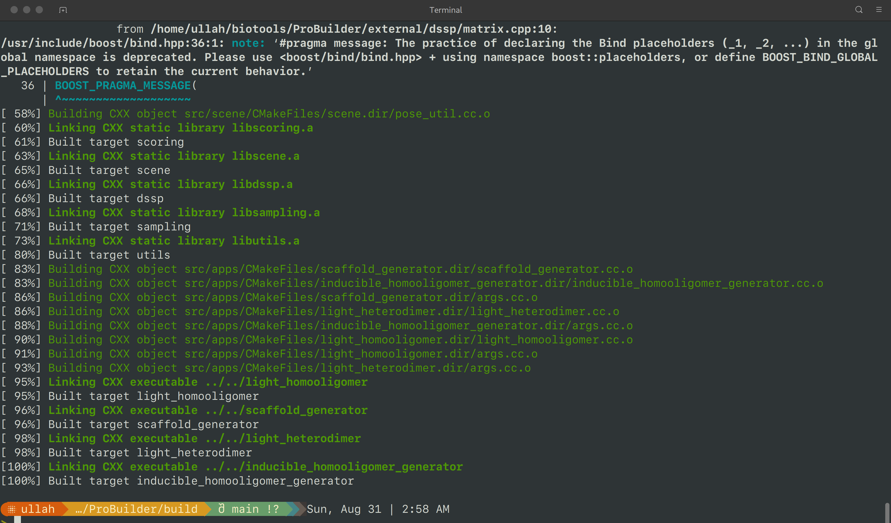

# ProBuilder
A Super Fast Protein Structure Generation Package

Probuilder is designed to generate protein backbone structure with predefined requirements, like folding, small molecule interaction, protein binding and ion binding. All the calculations are based solely on backbone coordinates and geometric constrains, so it is lightningly fast.


All the external libraries have been included in this repo (see the acknowledge section for the external library used here). To build the apps, you need to have the boost library (v1.67 used on my computer). By default, all the apps are build in the static mode, so they can be easily run on other computers once compiled:

```bash
sudo apt-get update
sudo apt-get install libboost-all-dev

cd build
cmake ..
make -j 24
```


## Scaffold generation
The `scaffold_generator` can rapidly generate helical protein scaffolds. It takes the desired protein length and number of helices as input and builds scaffolds through fragment assembly. The tool uses the residue pair transform score (RPX score) to guide protein folding. Essentially, it performs the same function as the blueprint system in Rosetta, but operates significantly faster. An example is provided in the example folder, with the meaning of the options described in the example.

## Other applications
The usage of other applications is detailed in separate Git repositories. Please refer to the links provided in our papers for more information.

## Database
The ProBuilder package requires the fragment database for building new structures and rpx score database for scoring purpose. However, these two databases too large to be deposited on github. You can download them from: [10.5281/zenodo.16492615](https://doi.org/10.5281/zenodo.16492615).

## Acknowledgements

ProBuilder utilized the libraries or source code from the following packages:

*   [gzip](https://www.gnu.org/software/gzip/)
*   [modified version of dssp](https://github.com/cmbi/dssp)
*   [Eigen](https://eigen.tuxfamily.org/index.php?title=Main_Page)
*   [json](https://github.com/nlohmann/json)
*   [xbin module of rpxdock](https://github.com/willsheffler/rpxdock)
*   [parallel_hashmap](https://github.com/greg7mdp/parallel-hashmap)
